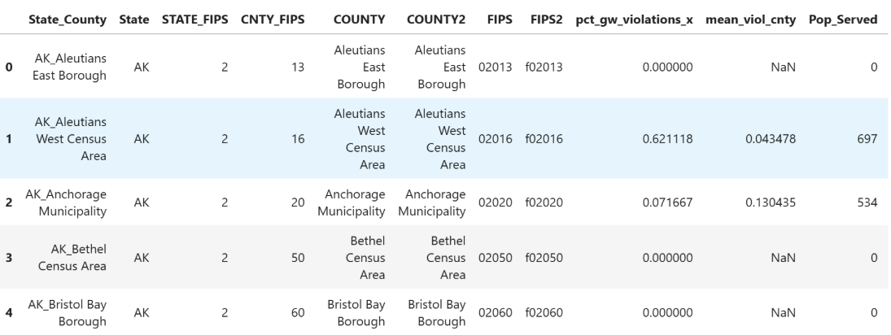
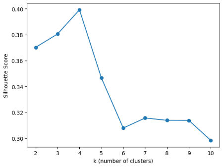
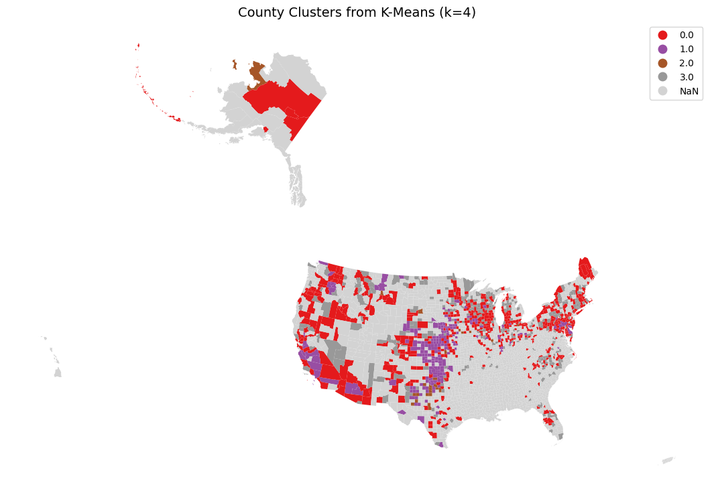

# water-safety-research

# Predicting Water System Violations - Technical Report

## Introduction

Water is essential for all life, but not all water is clean and drinkable. There are many cases and many concerns about the cleanliness of water, whether it’s truly pure or contaminated with things we cannot see like bacteria and viruses. Last year's Article *Toxic Tap Water* by Evangelyn Rodriguez for EPA WATCH.org explains that there are many hidden chemicals and heavy metals in tap water that can be linked to things like cancer. The concern for this is real. 

On a grander scale are water system violations. Huge supplies of water that exceed contamination limits, people failing to report test results, pipe bursts or failures, etc. There are many reasons why this can happen and it can easily result in ongoing public health issues, especially in low-income areas and communities. As a group, we want to come together and see if we can predict which water systems are likely to get violations (whatever the cause) before they happen and be able to create visualizations detailing high risk areas ahead of time. Ultimately, we want to know:

**Can we use machine learning to identify key indicators of water system violations and use geographical mapping to show high risk areas?**

## Data Source

To answer this question, we are using the EPA safe drinking water information system that we accessed through the EPA ECHO data downloads: ([https://catalog.data.gov/dataset/safe-drinking-water-information-system-sdwis](https://catalog.data.gov/dataset/safe-drinking-water-information-system-sdwis) )

This dataset covers around 160,000 public water systems all around the U.S. and it included monitoring, enforcement, and violation data that was collected by states and then reported to the EPA.  The main features of this data set we plan to use include categories of state (geographical mapping), water source type (possible difference in contamination risk between surface and ground water), historical violation counts (likely strongest predictor), and population served (so we can see if smaller systems tend to have fewer compliance resources. 

## Dataset Limitations

The SDWIS only contains information that is self-reported by states. Due to reporting gaps, there are massive blind spots in the data. The dataset is missing large sections of the US, mostly throughout rural and lower income counties. This is most noticeable in the south, where there is almost no reported data available. The lack of reporting can be an indicator of issues despite a lack of data. These public water systems are the most at risk; they are likely to have lower funding and fewer compliance inspections. This analysis focuses on the regions with available data, but this gap has been kept in mind throughout the analysis.

## Data Cleaning and Feature Engineering

For modeling, we used 4 separate datasets that were merged on their common FIPS column. Each set included features needed for modeling, like population, groundwater violations and surface water violations. We decided to use FIPS code which are numeric identifiers for counties in the United States. A small but addressed matter is that numeric identifiers may start with zero like “01001” corresponding to Autauga County, Alabama. Python may drop the leading zero leading to it being read as “1001” which to python is different code. We then created a function to clean the data and make sure it was ready for merging. To fix the problem stated above we converted FIPS columns to text and padded the numbers, adding 0s to the top until they were all five digits long. The cleaned result is stored in a column named ‘FIPS’.  Then we applied this to the other data sets, cleaning the ‘FIPS’ column in every dataset to merge them later. This was done now because without standardized FIPS codes merging data could fail or produce missing values. 

When we were ready to merge, we created a separate variable df\_final with .copy() to ensure that changes made to this variable wouldn’t affect the original variables. With df\_final we merged the violations data frame keeping only FIPS and mean\_viol\_cnty, added population served keeping only FIPS and pop\_served and then merged gw which contains FIPS codes, groundwater percentage violations, and finally surface water violations including FIPS codes and percentage. Afterwards we made sure everything worked by checking the head of the data and whether it had any missing value. 

When merging everything with df\_final we merged it with gw and all its data came over but since df\_final is a copy of the original dataset that already included df it was unnecessary and would cause duplicate data. To prevent mistakes down the line we removed it here. After we filled any missing values with zero for modeling. We also created a new column of violations per 1000 people. This is because a county serving a million people would naturally have more violations than a county only serving a couple of thousand due to a larger water system. Instead of using raw violation count, the code counts violations per 1000 people which acts as a better target variable. Counties were labeled as high risk if their violations per 1,000 people were above the 75th percentile. This made high-risk counties the highest-risk quarter of the dataset.

## Machine Learning Models

We used three models to check results. The first model was a **Random Forest**, a good baseline resistant to overfitting. The second was a **Gradient Boosting** model that offers higher predictive performance and error correcting. Finally, we used **K-means Clustering**, which is unsupervised learning, taking a different interpretive approach to be discussed in a bit.

To determine the optimal number of clusters for K-Means, we tested values of k from 2 to 10 and evaluated each using a silhouette score. The silhouette score measures how well each data point fits within its assigned cluster compared to other clusters, with scores closer to 1 indicating better defined and more separated clusters. As shown in the chart below, the silhouette score peaked at k=4 with a score of 0.399, meaning four clusters produced the most distinct and internally consistent groupings out of all the values we tested. After k=4, the score dropped sharply and continued declining, which confirmed that adding more clusters beyond four did not improve the groupings and would only make the results harder to interpret. This is why k=4 was chosen as the final number of clusters rather than a larger or smaller value.

Random Forest had slightly better accuracy, but Gradient Boosting was better for the actual goal because it caught far more high-risk counties. The model we decided to use was a Gradient Boosting classifier, a model capable of making many small decision trees one after another. Each new tree tries to fix mistakes made by the previous trees. For the supervised models, we used groundwater violation percentage, surface-water violation percentage, and state as predictors. Population served was not used directly in the supervised model because it was already used to calculate violations per 1,000 people, but it was included later in the K-Means clustering analysis. With this, the model tries to predict a high violation (‘high\_violation’). Then we split the data into training and testing sets so we could test and train the model. After we created the model and stored it in the classifier (clf), we trained the model on the training set and evaluated it on the test set. The model’s job is to study relationships between the features and the targets, like if counties with higher groundwater violation percentages tend to have high overall violation rates or if population served influences the prediction. 

## Results

The supervised models were evaluated using accuracy, recall, F1-score, and ROC-AUC. Random Forest achieved slightly higher overall accuracy at 68.2%, but it only identified 31% of true high-risk counties. Gradient Boosting had slightly lower accuracy at 65.9%, but it achieved a higher ROC-AUC of 0.705 and identified 69% of true high-risk counties. Because the purpose of this project is to detect counties at risk for nitrate violations, Gradient Boosting was the more useful model. In a public health context, missing a truly high-risk county is more concerning than incorrectly flagging a lower-risk county for further review. The final supervised models used groundwater violation percentage, surface-water violation percentage, and state as predictors. Population served was not used directly in the supervised model, but it was used to calculate violations per 1,000 people and was included in the K-Means clustering analysis. This allowed the project to compare counties more fairly and identify whether smaller or larger systems showed different violation patterns.

 

## Technical Evaluation

Of the two supervised models Random Forest had a slightly better accuracy compared to Gradient Boosting but a much lower recall and slightly lower ROC-AUC. This makes Gradient Boosting our best performing supervised model, since it has better prediction rates for high-risk counties. Gradient Boosting classified counties as high risk or low risk for nitrate violations. We see more clusters of high-risk areas in the Midwest and northeast. K-Means Clustering grouped counties into four categories based on population served, groundwater violation percentage, surface-water violation percentage, and violations per 1,000 people. The silhouette score was 0.399, suggesting moderate cluster separation. Cluster 3 was the most concerning group because it had a very small average population served but the highest average violation rate per 1,000 people. This supports the ethical concern that small or rural communities may experience disproportionate water safety risks.

## Conclusion

Overall, the results show that machine learning helps to identify county-level patterns in nitrate-related water system violations. Gradient Boosting was the best supervised model because it identified more true high-risk counties than Random Forest, even though its overall accuracy was slightly lower. K-Means added an exploratory layer by showing that some smaller counties had especially high per-capita violation rates. This suggests that water safety risk is not only a problem in large systems, and that smaller or rural communities may need more attention in future monitoring.

**Ethical Analysis**

Through K-Means Clustering, we identified four distinct groups of counties based on population size and water violation data. The biggest concern is group 3, a group of mostly rural counties that have the highest per capita rate of water violations. These small communities are hit hardest by water violations and at a concerningly disproportionate rate. 

One explanation for the high concentration of nitrate in low population counties is the agriculture industry. Agricultural fertilizers have high concentrations of nitrogen. This nitrogen is not completely absorbed by the crops and enters water sources through agriculture runoff. This issue is worsened by federal agriculture policies, which subsidize the production of crops that require high amounts of fertilizer (Schechinger, 2026). There are additional factors that could contribute to this concentration of violations, such as lack of funding or resources available for proper regulation.

Due to a lack of data, a decent amount of U.S counties were unable to be mapped, which leaves out likely important data about smaller and less regulated water systems that are not represented in our results.

## References

*Safe Drinking Water Information System (SDWIS) Federal Reports Advanced  Search Tool.*   
	(2017, June 30). Data.gov; U.S. EPA Office of Research and Development (ORD).   
	https://catalog.data.gov/dataset/safe-drinking-water-information-system-sdwis  
	\-federal-reports-advanced-search-tool

Ground Water and Drinking Water | US EPA. (2013, February 20). US EPA.   
	[https://www.epa.gov/ground-water-and-drinking-water/](https://www.epa.gov/ground-water-and-drinking-water/)

Schechinger, Anne. “Drinking Water of Almost 1 in 5 Americans Contains Nitrates Linked   
	to Cancer and Birth Defects.” *Environmental Working Group*, 23 Apr. 2026,   
	www.ewg.org/research/drinking-water-almost-1-5-americans-contains-nitrates  
	\-linked-cancer-and-birth-defects

## AI Transparency

Claude was used to assist with proofreading, markdown formatting, and explanation of machine learning concepts.
